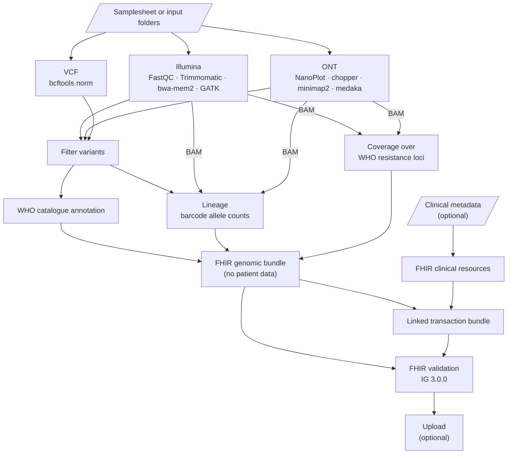

# Pipeline architecture

Every sample follows the branch for its platform, then joins the shared steps. The clinical, link
and upload steps run only when their parameters are given.

```mermaid
flowchart TD
    IN[/"Samplesheet or input folders"/]
    IN --> ILL["Illumina<br/>FastQC · Trimmomatic · bwa-mem2 · GATK"]
    IN --> ONT["ONT<br/>NanoPlot · chopper · minimap2 · medaka"]
    IN --> VCF["VCF<br/>bcftools norm"]
    ILL & ONT & VCF --> FIL["Filter variants"]
    ILL & ONT -->|BAM| COV["Coverage over<br/>WHO resistance loci"]
    FIL --> ANN["WHO catalogue annotation"]
    FIL --> LIN["Lineage<br/>barcode allele counts"]
    ILL & ONT -->|BAM| LIN
    ANN & LIN & COV --> GEN["FHIR genomic bundle<br/>(no patient data)"]
    META[/"Clinical metadata<br/>(optional)"/] --> CLIN["FHIR clinical resources"]
    GEN & CLIN --> LINK["Linked transaction bundle"]
    GEN & LINK --> VAL["FHIR validation<br/>IG 3.0.0"]
    VAL --> UP["Upload<br/>(optional)"]
```
